**项目简介：**  
本项目基于主流的前后端分离架构，采用 **SpringBoot + Vue 技术栈**，配套 **MySQL 数据库**，适用于毕业设计与课题实训开发。  
本人已整理了超 **4000 多套毕业设计源码+论文+开题报告+PPT...**，涵盖 **Java、SpringBoot、Vue、SSM、uni-app 小程序、PHP、Android** 等方向，支持功能修改定制与论文服务。  
**团队提供以下服务：**  
- 项目代码修改与调试  
- 数据库配置与远程协助  
- 论文定制与修改  
**获取更多的4000多套源码或SQL文件请联系：**  
- QQ：3906443360 微信：BesheHelp

# springboot213大学生心理健康管理系统的设计与实现

## 第四章 系统设计

4.1 总体功能

大学生心理健康管理系统是根据需求定制开发，开发软件选用IDEA平台配合MySQL数据库进行开发环境的搭建操作，网站采用WEB应用程序中最流行的B/S结构进行开发，用户访问系统数据仅仅需要在客户端安装谷歌浏览器或者是当下常用浏览器就可以访问网站内容。

4.2 系统模块设计

大学生心理健康管理系统系统在进行系统中功能模块的划分时，采用层次图来进行表示。层次图具有树形结构，它能使用矩形框来描绘数据信息。顶层代表的数据结构很完整，顶层下面的矩形框表示的数据就是子集数据，当然处于最下面的矩形框就是不能再进行细分的数据元素了，使用层次方框图描述系统功能能让用户一目了然，能够明白系统的功能，以及对应功能板块下面的子功能都可以清楚领会。大学生心理健康管理系统分为管理员和用户两部分操作角色，下面将对他们的功能进行阐述。

管理员可以管理用户的基本信息，可以管理等功能。管理员功能结构图如下：

图4.1 管理员功能结构图

4.3 数据库设计

开发一个系统也需要提前设计数据库。这里的数据库是相关数据的集合，存储在一起的这些数据也是按照一定的组织方式进行的。目前，数据库能够服务于多种应用程序，则是源于它存储方式最佳，具备数据冗余率低的优势。虽然数据库为程序提供信息存储服务，但它与程序之间也可以保持较高的独立性。总而言之，数据库经历了很长一段时间的发展，从最初的不为人知，到现在的人尽皆知，其相关技术也越发成熟，同时也拥有着坚实的理论基础。

4.3.1 数据库概念设计

这部分内容需要借助数据库关系图来完成，也需要使用专门绘制数据库关系图的工具，比如Visio工具就可以设计E-R图（数据库关系图）。设计数据库，也需要按照设计的流程进行，首先还是要根据需求完成实体的确定，分析实体具有的特征，还有对实体间的关联关系进行确定。最后才是使用E-R模型的表示方法，绘制本系统的E-R图。不管是使用亿图软件，还是Visio工具，对于E-R模型的表示符号都一样，通常矩形代表实体，实体间存在的关系用菱形符号表示，实体的属性也就是实体的特征用符号椭圆表示。最后使用直线将矩形，菱形和椭圆等符号连接起来。接下来就开始对本系统的E-R图进行绘制。

（1）下图是心理老师实体和其具备的属性。

图4.1 心理老师实体属性图

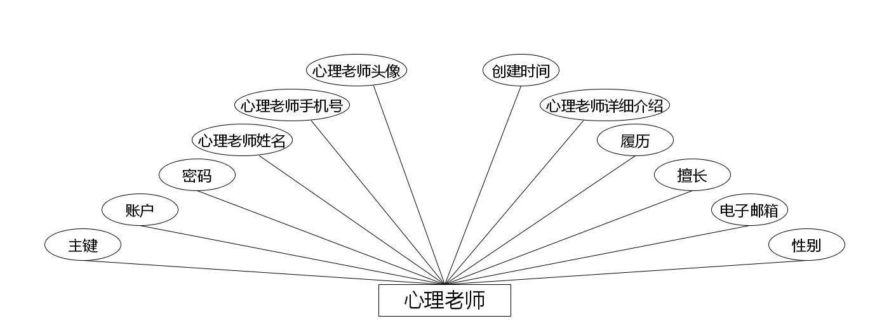

（2）下图是考试记录表实体和其具备的属性。

图4.2 考试记录表实体属性图

（3）下图是答题详情表实体和其具备的属性。

图4.3 答题详情表实体属性图

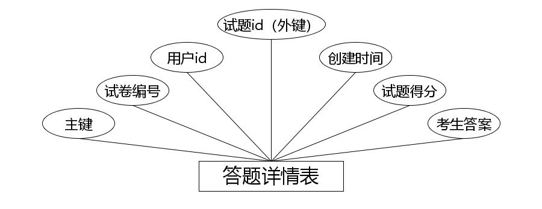

（4）下图是错题表实体和其具备的属性。

图4.4 错题表实体属性图

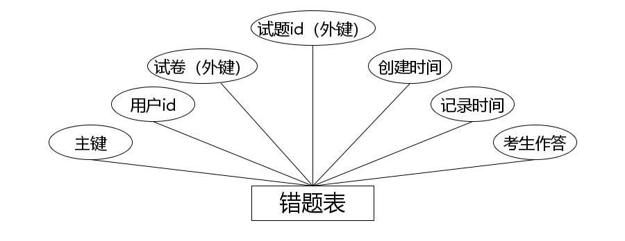

（5）下图是健康知识实体和其具备的属性。

图4.5 健康知识实体属性图

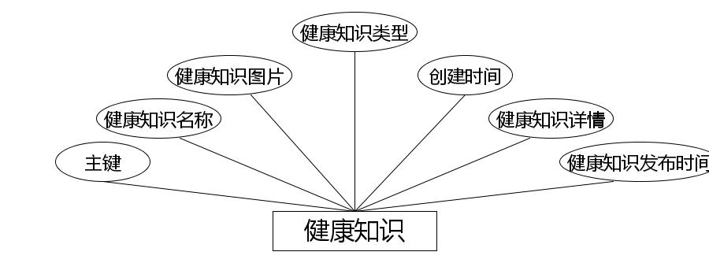

（6）下图是心理老师留言实体和其具备的属性。

图4.6 心理老师留言实体属性图

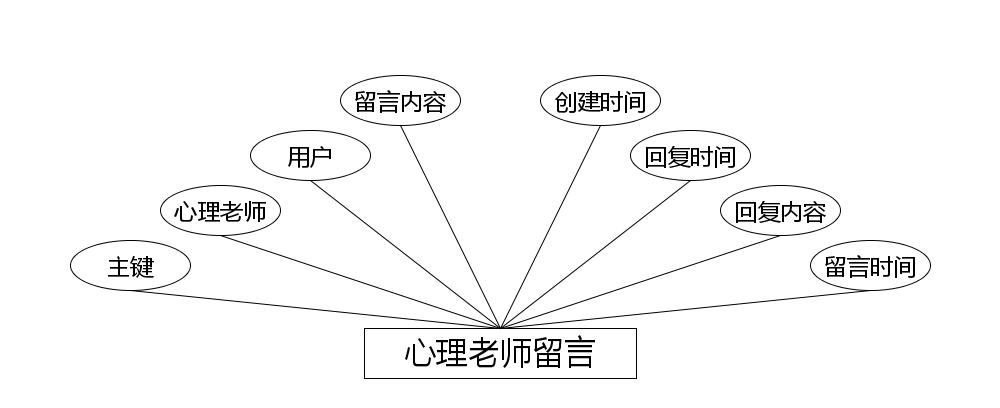

（7）下图是试卷表实体和其具备的属性。

图4.7 试卷表实体属性图

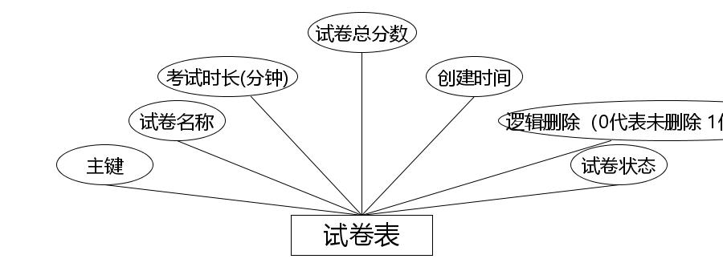

（8）下图是学生实体和其具备的属性。

图4.8 学生实体属性图

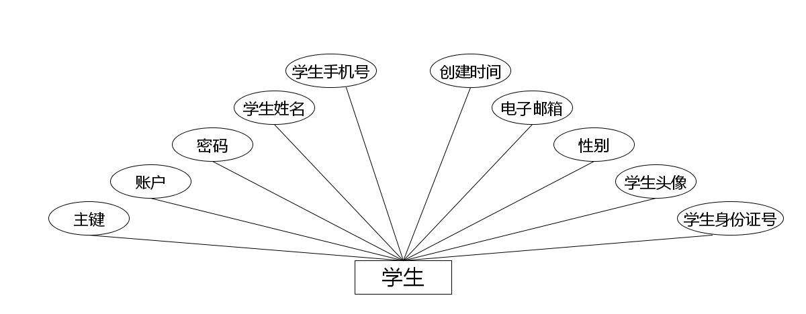

（9）下图是试题表实体和其具备的属性。

图4.9 试题表实体属性图

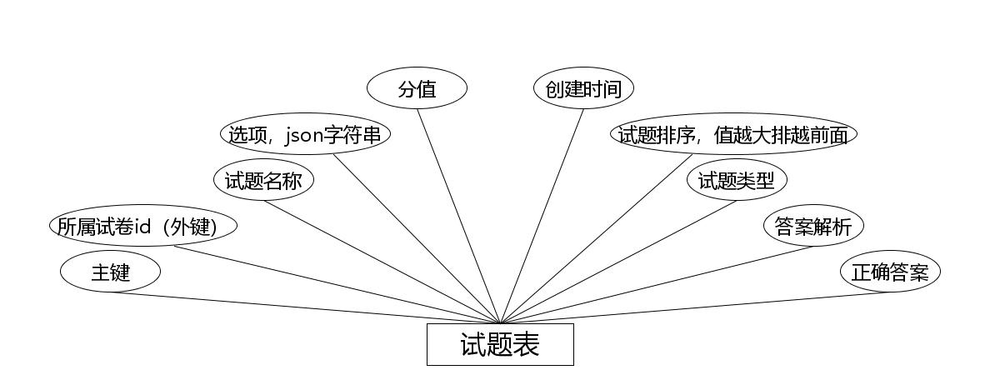

（10）下图是通知实体和其具备的属性。

图4.10 通知实体属性图

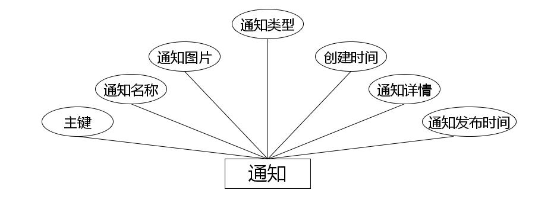

（11）下图是心理老师预约订单实体和其具备的属性。

图4.11 心理老师预约订单实体属性图

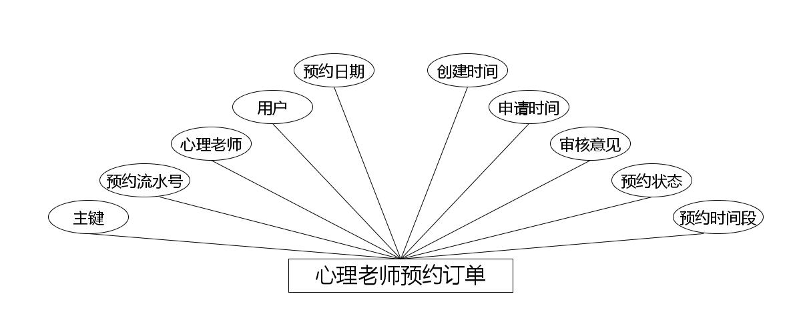

（12）下图是心理老师收藏实体和其具备的属性。

图4.12 心理老师收藏实体属性图

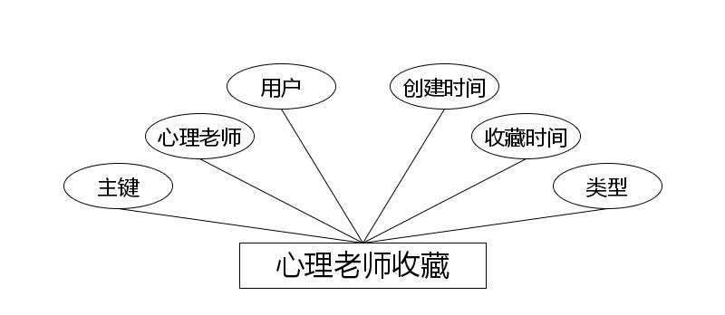

4.3.3 数据库表设计

数据库里面的数据表存放的就是各种数据记录，我们在进行系统增删改查操作时，其实也是在对应数据表里面进行的增删改查操作，一个好的数据库能够缩短信息处理时间，所以说数据库的设计工作不容小觑，数据库里面设置哪些表，表里面的字段设计以及字段类型和字段长度等信息都要考虑周到才行，比如时间这个字段，它的数据类型就不能是int型，不然在系统操作中就会弹出输入数据格式不符合要求的报错提示。下面简单介绍大学生心理健康管理系统的一些数据表。

表4.1字典表

表4.2试卷表表

表4.3试题表表

表4.4考试记录表表

表4.5答题详情表表

表4.6错题表表

表4.7健康知识表

表4.8通知表

表4.9心理老师收藏表

表4.10心理老师留言表

表4.11心理老师预约订单表

表4.12学生表

表4.13心理老师表

表4.14管理员表

第五章 系统实现

5.1 管理员功能模块的实现

5.1.1 试卷列表

如图5.1显示的就是试卷列表页面，此页面提供给管理员的功能有：查看试卷、新增试卷、修改试卷、删除试卷等。

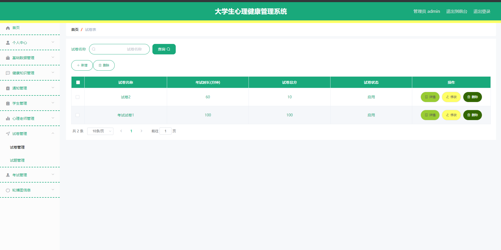

图5.1 试卷列表页面

5.1.2 通知信息管理

管理员可以对前台的注册用户的基本信息进行管理，可以设置注册用户的账号为冻结或者是在用状态，管理员也能选择很多个已经失效的注册用户的信息进行批量删除操作。注册用户管理界面如图5.2所示。

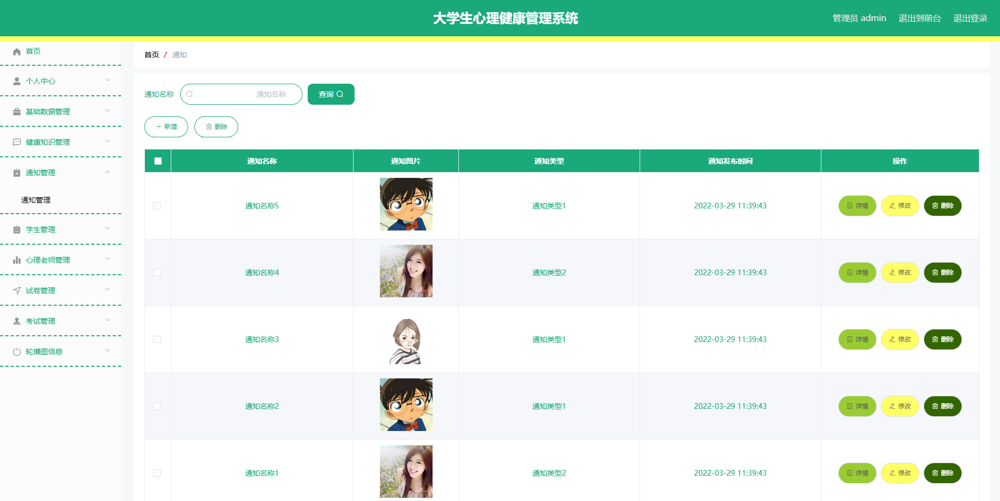

图5.2 通知信息管理页面

5.1.3 通知类型管理

通知类型管理页面显示所有通知类型，在此页面既可以让管理员添加新的通知信息类型，也能对已有的通知类型信息执行编辑更新，失效的通知类型信息也能让管理员快速删除。下图就是通知类型管理页面。通知类型管理界面如图5.3所示。

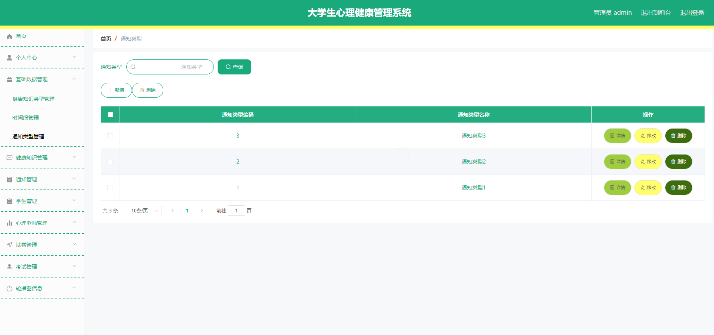

图5.3通知类型管理界面

